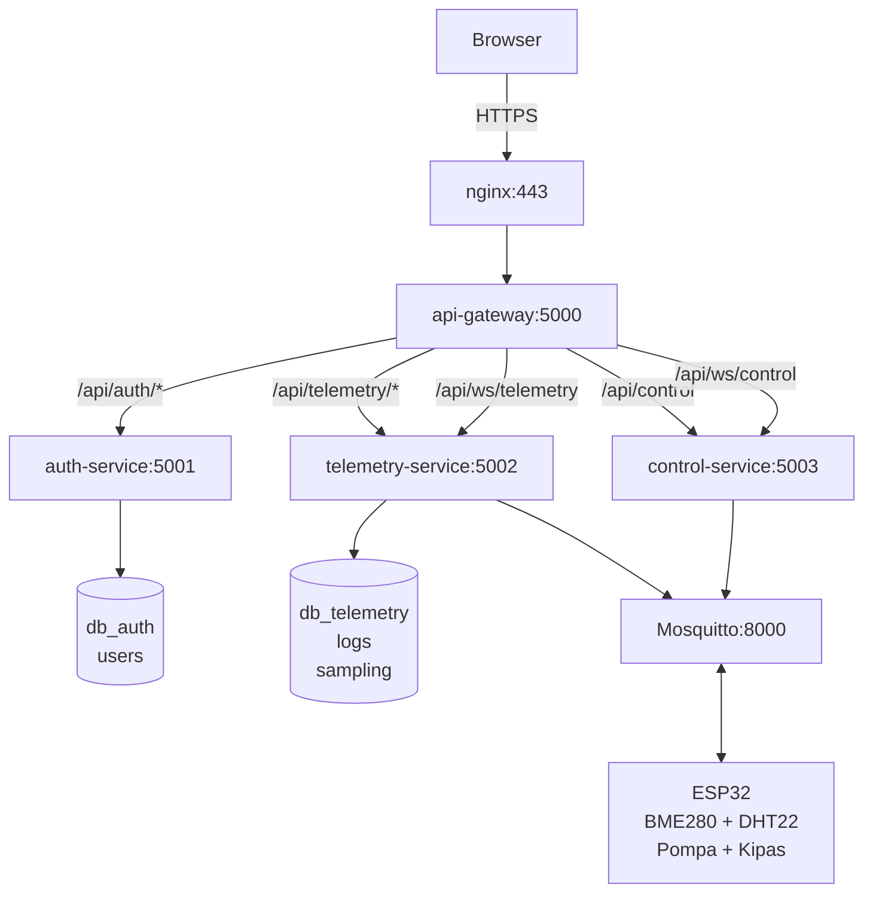

# HVAS — Alat Sampling Udara

Sistem Monitoring & Kontrol Alat Sampling Lab Udara Berbasis Microservice dengan Enkripsi SSL/TLS dan Autentikasi JWT.

## Tech Stack

| Komponen       | Teknologi                        |
| -------------- | -------------------------------- |
| Backend        | Node.js, Express.js              |
| Frontend       | Vue 3, Vite, Tailwind CSS, Pinia |
| Database       | PostgreSQL 15                    |
| Message Broker | Eclipse Mosquitto (MQTT)         |
| Realtime       | WebSocket (ws)                   |
| Auth           | JWT (Access + Refresh Token)     |
| Encryption     | SSL/TLS (Nginx + Mosquitto)      |
| Container      | Docker Compose                   |
| IoT            | ESP32, BME280, DHT22             |

## Arsitektur



## Fitur

### Admin

- Dashboard analitik real-time (suhu, kelembaban, tekanan udara)
- Manajemen akun teknisi (CRUD)
- Laporan audit — daftar semua sesi sampling dengan search & filter tanggal (export ke CSV/Excel)
- Profil administrator

### Teknisi

- Kontrol pompa sampling (Manual / Auto Cycle)
- Kontrol kipas panel (Auto / Manual)
- Kontrol eksklusif — hanya teknisi dengan sesi sampling aktif yang bisa kendali alat
- Monitor sensor real-time via WebSocket
- Riwayat data & grafik tren 1 jam terakhir
- Laporan Sampling — buat sesi sampling, lihat data 24 jam, export ke Excel
- Pengaturan profil

### Keamanan

- SSL/TLS untuk semua komunikasi (HTTPS + MQTTS)
- JWT Access Token (15 menit) + Refresh Token (24 jam, httpOnly cookie)
- Single session — login di perangkat lain menggantikan sesi lama
- Sesi sampling eksklusif — satu teknisi per sesi 24 jam, teknisi lain hanya monitoring
- TOKEN_ESP sebagai shared secret antara ESP32 dan server

## Struktur Project

```
ta-hvas/
├── docker-compose.yml
├── backend/
│   ├── api-gateway/          # Reverse proxy (Express + http-proxy-middleware)
│   ├── auth-service/         # Autentikasi & manajemen user
│   ├── telemetry-service/    # Terima data sensor via MQTT, simpan ke DB
│   │   ├── src/
│   │   │   ├── controllers/  # logsController, samplingController
│   │   │   ├── middlewares/  # authMiddleware (JWT verification)
│   │   │   ├── routes/       # logsRoutes, samplingRoutes
│   │   │   ├── services/     # logsService (MQTT + DB writer)
│   │   │   └── config/       # database.js
│   │   └── init.sql          # Schema: logs, sampling
│   ├── control-service/      # Kirim perintah ke ESP32 via MQTT
│   ├── certs/                # Sertifikat SSL/TLS
│   ├── nginx.conf
│   └── mosquitto.conf
├── frontend/
│   └── src/
│       ├── views/            # Login, AdminDashboard, TeknisiDashboard
│       ├── components/       # UI components
│       ├── services/         # API client (axios), WebSocket
│       ├── stores/           # Pinia stores (auth, sensor)
│       └── router/           # Vue Router with role guards
└── README.md
```

## Prasyarat

- Node.js 20+
- Docker & Docker Compose
- OpenSSL (untuk generate sertifikat SSL)
- ESP32 dengan sensor BME280, DHT22, relay pompa & kipas

## Instalasi & Deployment

### 1. Generate Sertifikat SSL

```bash
cd backend/certs
# Ganti "IP SERVER" dengan IP address server Anda
openssl req -x509 -nodes -days 3650 -newkey rsa:2048 \
  -keyout hvas.key \
  -out hvas.crt \
  -subj "/O=BSPJI/OU=Lab Udara/CN=IP SERVER" \
  -addext "subjectAltName=IP:IP SERVER"
```

### 2. Konfigurasi Environment

```bash
# Copy .env.example ke .env untuk setiap service
cp backend/auth-service/.env.example backend/auth-service/.env
cp backend/telemetry-service/.env.example backend/telemetry-service/.env
cp backend/control-service/.env.example backend/control-service/.env
cp backend/api-gateway/.env.example backend/api-gateway/.env

# Edit .env sesuai kebutuhan (lihat .env.example untuk referensi)
```

### 3. Build Frontend

```bash
cd frontend
npm install
npm run build
```

### 4. Jalankan dengan Docker

```bash
docker compose up -d --build
```

### 5. Akses Aplikasi

- **Frontend**: `https://IP_SERVER`
- **API Gateway**: `https://IP_SERVER/api`
- **Default Login**: `teknisi_bspji` / `teknisi_bspji`

## Development

### Jalankan Secara Lokal (tanpa Docker)

```bash
# Terminal 1 — Auth Service
cd backend/auth-service && npm install && npm run dev

# Terminal 2 — Telemetry Service
cd backend/telemetry-service && npm install && npm run dev

# Terminal 3 — Control Service
cd backend/control-service && npm install && npm run dev

# Terminal 4 — API Gateway
cd backend/api-gateway && npm install && node index.js

# Terminal 5 — Frontend
cd frontend && npm install && npm run dev
```

### API Endpoints

| Method | Endpoint                      | Auth    | Deskripsi                  |
| ------ | ----------------------------- | ------- | -------------------------- |
| POST   | `/api/auth/login`             | No      | Login                      |
| POST   | `/api/auth/refresh`           | Cookie  | Refresh token              |
| POST   | `/api/auth/logout`            | Bearer  | Logout                     |
| GET    | `/api/auth/profile`           | Bearer  | Profil user                |
| PUT    | `/api/auth/profile`           | Bearer  | Update profil              |
| POST   | `/api/auth/register`          | Admin   | Tambah user                |
| GET    | `/api/auth/users`             | Admin   | List users                 |
| PUT    | `/api/auth/users/:id`         | Admin   | Update user                |
| DELETE | `/api/auth/users/:id`         | Admin   | Hapus user                 |
| GET    | `/api/telemetry/logs`                  | No      | Data sensor (500 terakhir) |
| GET    | `/api/telemetry/sampling`              | Bearer  | Daftar sesi sampling       |
| GET    | `/api/telemetry/sampling/active-session` | Bearer | Cek sesi sampling aktif    |
| POST   | `/api/telemetry/sampling`              | Bearer  | Buat sesi sampling baru    |
| PUT    | `/api/telemetry/sampling/:id`          | Bearer  | Update sesi sampling       |
| DELETE | `/api/telemetry/sampling/:id`          | Bearer  | Hapus sesi sampling        |
| POST   | `/api/control`                         | Teknisi | Kontrol pompa/kipas        |

### MQTT Topics

| Topic                     | Direction    | Deskripsi                                      |
| ------------------------- | ------------ | ---------------------------------------------- |
| `esp/data/{TOKEN_ESP}`    | ESP → Server | Data sensor (suhu, kelembaban, tekanan)        |
| `esp/control/{TOKEN_ESP}` | Server → ESP | Perintah kontrol (ON/OFF/CYCLE/SET_MODE_KIPAS) |

## Sensor & Hardware

| Komponen         | Fungsi                                      | Pin ESP32          |
| ---------------- | ------------------------------------------- | ------------------ |
| BME280           | Suhu dalam, kelembaban dalam, tekanan udara | SDA (21), SCL (22) |
| DS3231           | RTC (Real-Time Clock)                       | SDA (21), SCL (22) |
| DHT22            | Suhu luar, kelembaban luar                  | GPIO 4             |
| SSR Relay 40A #1 | Motor pompa sampling 1 (0s hidup)           | GPIO 19            |
| SSR Relay 40A #2 | Motor pompa sampling 2 (3s setelah #1)      | GPIO 18            |
| SSR Relay 40A #3 | Motor pompa sampling 3 (6s setelah #1)      | GPIO 26            |
| Relay 5V         | Kipas pendingin panel                       | GPIO 27            |

> **Catatan Inrush Current:** Ketiga relay pompa diaktifkan secara berurutan dengan jeda 3 detik (0s → 3s → 6s) untuk mengatasi lonjakan arus awal (inrush current) pada motor induktif. Semua relay pompa menggunakan SSR 40A.

## Troubleshooting

| Masalah                         | Solusi                                                     |
| ------------------------------- | ---------------------------------------------------------- |
| `docker compose up` gagal | Pastikan `hvas.crt` dan `hvas.key` ada di `backend/certs/` dan `frontend/dist` sudah di-build |
| Frontend tidak bisa connect API | Cek `FRONTEND_URL` di `api-gateway/.env`                   |
| WebSocket terputus terus        | Pastikan Mosquitto running: `docker logs hvas-mqtt`        |
| Data sensor tidak muncul        | Cek `TOKEN_ESP` sama di `.env` dan ESP32                   |
| Login gagal                     | Cek `JWT_SECRET` di `auth-service/.env`                    |
| Tabel `sampling` tidak ada      | Jalankan SQL manual atau hapus volume `pgdata_telemetry` lalu restart |
| Kolom `kondisi_cuaca` tidak ada | Jalankan: `ALTER TABLE sampling ADD COLUMN kondisi_cuaca VARCHAR(100) NOT NULL DEFAULT 'Cerah';` |

## License

Tugas Akhir — D3 Teknik Komputer, Politeknik Negeri Padang
